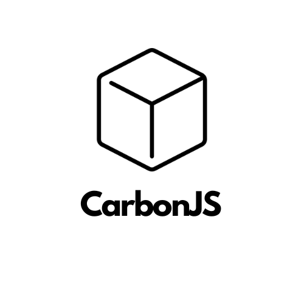

# CarbonJS

A KubeJS script manager


## Features

- 🔥 Super fast
- ⚙️ Version control
- 📁 Constantly new scripts being added
- ✅ Easy to use
- 🧱 Compatibility with [KJSPKG](https://github.com/orgs/gcatkjspkgs/repositories?type=all) packages. (`carbon add kjspkg:<script_name>` script name corresponds to the repository from [KJSPKG](https://github.com/orgs/gcatkjspkgs/repositories?type=all))

## Installation

**Requirements**

- [curl](https://curl.se/) - to install cargo (on linux and macos)
- [cargo](https://www.rust-lang.org/) - comes by default with rust

```bash
    1. Install rust.
    2. `cargo install CarbonJS` - case sensitive
```
    

## Contributing

Contributions are always welcome!

Please adhere to this project's `code of conduct`.


## Usage

```http
  carbon <command>
```

| Commands | Arguments | Description                |
| :-------- | :--------- | :------------------------- |
| list | none | Return url to github org, where all packages are stored. |
| add | <script_name> | Adds new script by name. |
| info | <script_name> | Return info about package |
| remove | <script_name> | Removes package |

## Authors

- [@malezjaa](https://github.com/malezjaa)

